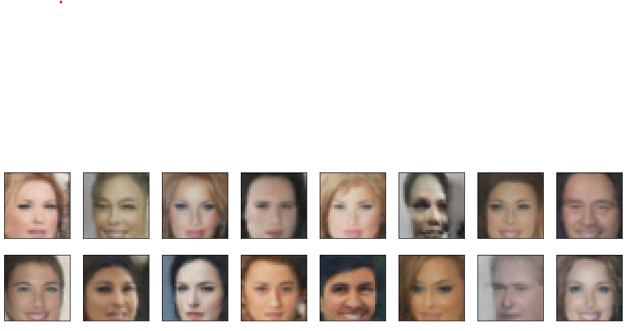

# Face Generation

In this project, we had to  define and train a DCGAN on a dataset of faces. Our goal was to get a generator network to generate new images of faces that look as realistic as possible!

to view...

clone this repo and open the html file.

The final 'generated' faces looked like this..

